# unit13-challenge
#### Clustering Cryptocurrencies Using K-Means

## by Nedal mahanweh 

In this project, we will put the unsupervivsed learning and Amazon SageMaker skills into action by clustering cryptocurrencies and creating plots to present results.

### Main tasks 

* ` Data Preprocessing `: Prepare data for dimension reduction with PCA and clustering using K-Means.

* ` Reducing Data Dimensions Using PCA ` : Reduce data dimension using the PCA algorithm from sklearn.

*  ` Clustering Cryptocurrencies Using K-Means ` : Predict clusters using the cryptocurrencies data using the KMeans algorithm from sklearn.

* ` Visualizing Results `  : Create some plots and data tables to present the  results.

* `Using Amazon SageMaker `: upload the  Jupyter notebook to Amazon SageMaker and deploy it.
---

### Files
* [crypto_clustering.ipynb](crypto_clustering.ipynb)
* [crypto_clustering_sm.ipynb](crypto_clustering_sm.ipynb)
* [images](Images)
* [Resources](Resources)
---
#### Data Preprocessing
In this section, we  will load the information about cryptocurrencies and perform data preprocessing tasks Using the following `requests` library, retreive the necessary data from the following API endpoint from _CryptoCompare_ - `https://min-api.cryptocompare.com/data/all/coinlist`. 

after doing the cleaning process , we stored the  names of all cryptocurrencies in a DataFrame named ` coins_name `, using the ` crypto_df.index `  as the index for this new DataFrame.

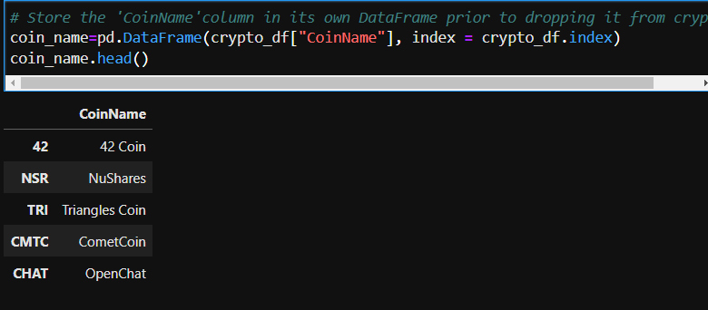

as our features data have non numeric values , we have to Create dummy variables for all the text features, and store the resulting data in a DataFrame named X.

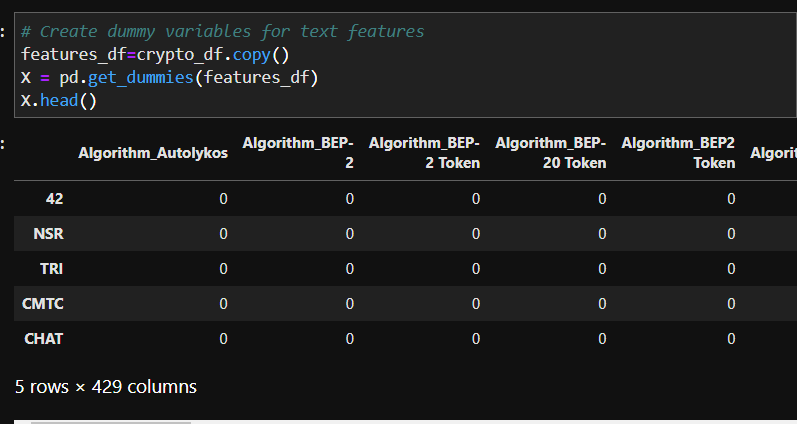

Use the [`StandardScaler` from `sklearn`](https://scikit-learn.org/stable/modules/generated/sklearn.preprocessing.StandardScaler.html) to standardize all the data of the `X` DataFrame.  This is important prior to using PCA and K-Means algorithms.

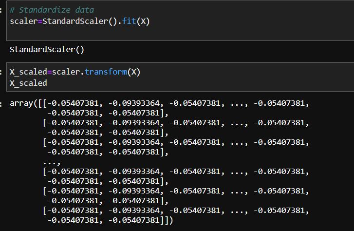

---

### Reducing Data Dimensions Using PCA

Use the *PCA* algorithm from sklearn to reduce the dimensions of the X DataFrame down to three principal components.

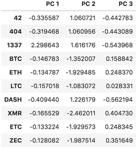
 
 
----

#### Clustering Cryptocurrencies Using K-Means

In this section, we will use the [`KMeans` algorithm from `sklearn`](https://scikit-learn.org/stable/modules/generated/sklearn.cluster.KMeans.html) to cluster the cryptocurrencies using the PCA data.

---

#### Visualizing Results

In this section, we will create some data visualization to present the final results.

*  Create a 3D-Scatter using Plotly Express to plot the clusters using the `clustered_df` DataFrame.

 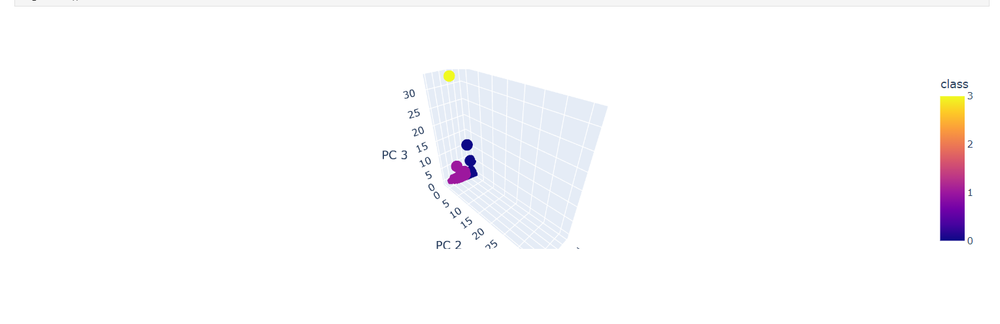

*  Use `hvplot.table` to create a data table with all the current tradable cryptocurrencies.

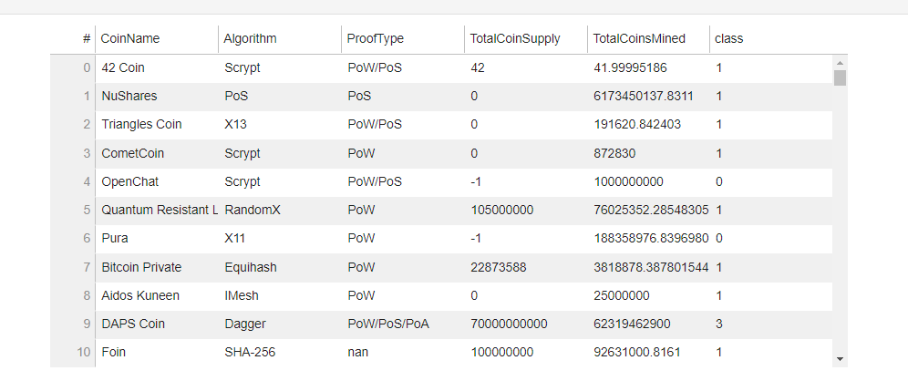

* Create a scatter plot using `hvplot.scatter`, to present the clustered data about cryptocurrencies

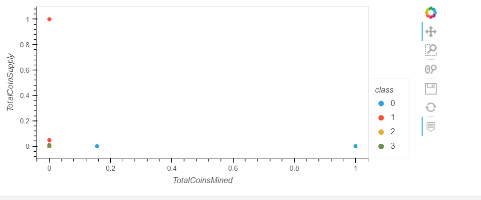

---
## uploading the  Jupyter notebook to Amazon SageMaker and deploy it.

Use the altair scatter plot to create the Elbow Curve.

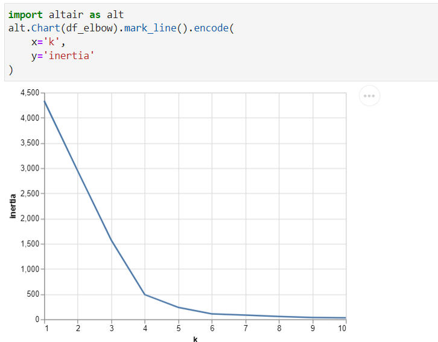

Use the altair scatter plot, instead of the 3D-Scatter from Plotly Express, to visualize the clusters.

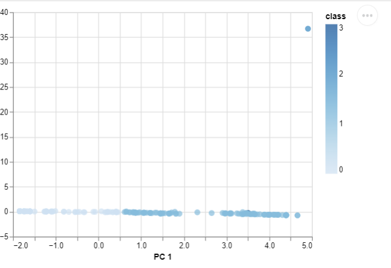

show the table of current tradable cryptocurrencies using the ` display() ` command.

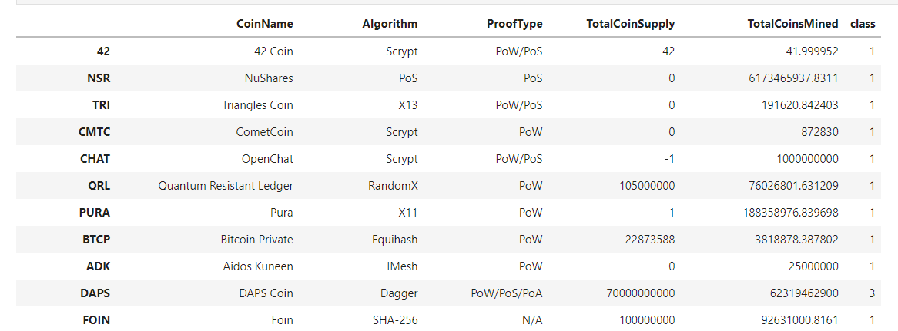

Use the` altair scatter plot `  to visualize the tradable cryptocurrencies

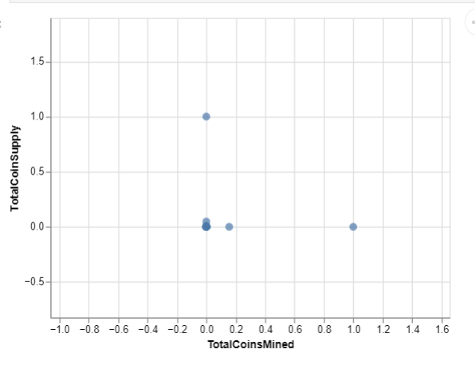

